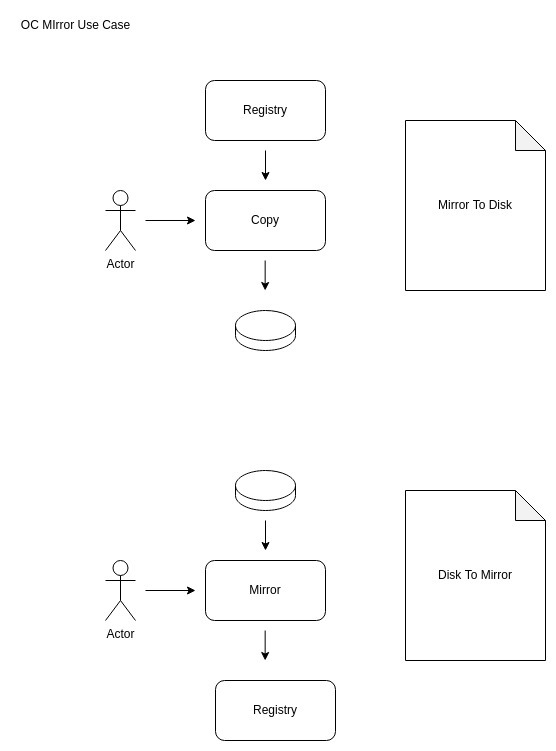
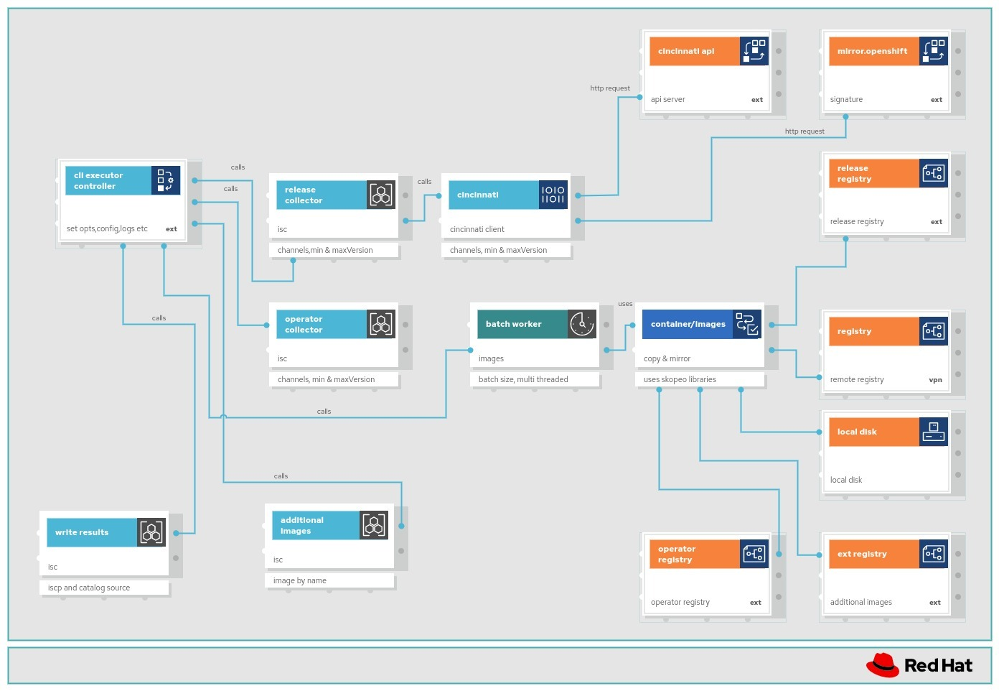

# Improving user experience of oc-mirror plugin

## Summary

This is a proposed solution for a loosely coupled implementation of oc-mirror plugin, addressing the improvement of user experience, as well as anticipating deprecation of mirroring functionalities of `oc adm` thus preparing oc-mirror to become the de-facto tool for mirroring.

## Motivation

Since oc-mirror is generally available, customers have been facing a number of issues regarding the tool. This enhancement aims at finding solutions for these issues: 
- Essential library dependencies are getting deprecated / or are un-recommended
- Auto pruning, this leads to situations where cluster upgrades are blocked
- Filtering operator catalogs is generally not understood by customers
- Performance and stability are not great
- Code complexity is high, and introducing new features is slow and difficult

| Problems | Detailed Description | Proposed solution |
|---|---|---|
| Essential library dependencies are getting deprecated / or are un-recommended |- `oc adm release mirror` and `oc adm catalog mirror` are getting deprecated. <br> - OPM's render has been flagged as not recommended for use by OLM team  | - Replace the `render` and `oc adm * mirror` functions with internal more efficient functions <br> - Resolve to use one simpler library i.e container/images (skopeo) <br> - Reduce complexity due to image references being handled differently by libraries <br> - Resolve issues that are caused by dependencies more easily
| Auto pruning: Leads to situations where cluster upgrades are blocked   | Pruning images from the registry is done automatically today at the end of each mirroring, with no rollback possible. This can block cluster upgrades in some situations.  | Implement a new delete feature and remove auto pruning code.  |
| Filtering operator catalogs is generally not understood by customers  | Tailoring an ImageSetConfig by the customer is not a straightforward task: It involves understanding the operator's current version, finding the upgrade path, and setting the parameters accordingly.<br> Ex: Including the default channel is mandatory [OCPBUGS-385](https://issues.redhat.com/browse/OCPBUGS-385)  | Make mirroring operators more intuitive, by relying on incoming contextual upgrade path metadata (to be implemented in collaboration with OLM) to filter and mirror the catalog as expected by the disconnected cluster.
| Performance and stability are not great | - A complex mirror can take hours (i.e it could take 10 hrs or more) to mirror release, catalogs and additionalImages. <br> - 401 errors - inconsistent| - Reduce time to mirror (even if we improve by 10% it's a saving). Revisit concurrency in image copying/mirroring - all cases <br> - Use file based caching with container/images library. <br> - Allow for v2docker2 and oci format <br> - Improve the auth/credentials refresh and remove dependency on operator-framework code
| Code complexity is high, and introducing new features is slow and difficult | - The current oc-mirror architecture is difficult to maintain on the long term <br> - No guarantee that new features will break current code | - Apply a low coupling and high cohesion architecture <br> - Improve test coverage and linting <br> - Improve E2E testing and complex integration testing (multi versions outside of current ci/cd builds) <br> - First class tool for mirroring

### User Stories

- As a user I want to copy images from a registry to local disk so that I can have an incremental version of all relative images to install and deploy openshift (release, operators, additional and helm charts)

- As a user I want to mirror the incremental local images from disk in a partial or fully disconnected environment to a remote registry so that I can install and update OpenShift easily




### Goals

With this proposal, we're trying to answer the above expectations and achieve the following goals:

- Make pruning a separate sub-command of oc-mirror, with its own configuration section in ImageSetConfig
- Rethink incremental mirroring: answer broader use-cases ([RFE-3393](https://issues.redhat.com/browse/RFE-3393), [RFE-3733](https://issues.redhat.com/browse/RFE-3733)) and limit issues ([Case 03428800](https://access.redhat.com/support/cases/#/case/03428800))
- Rethink operator catalogs mirroring by taking into account 
  - which operators are already installed, and the versions of those operators
  - the upgrade paths that are available for these  operators starting the above versions
- MirrorToMirror workflow will be supported chaining mirrorToDisk and diskToMirror workflows
- Achieve better performance
- Robustness in the face of unstable network
  - Ability to stop and start
    - Ex: Cruise ships can use bandwidth from 00:00AM to 04:00AM only
    - Ability to retry when network is flaky, when credentials expire example: [OCPBUGS-5393](https://issues.redhat.com/browse/OCPBUGS-5393)
- Reduce the complexity & make oc-mirror easier to maintain
  - Let go of dependencies to oc, opm
  - Pick and use a single module to process container images among [go-containerregistry](https://github.com/google/go-containerregistry), [containers/image](https://github.com/containers/image), [containerdregistry](https://github.com/containerd/containerd)
  - Increase the test coverage


### Non-Goals

- Releasing oc-mirror out of payload: oc-mirror can be considered an oc plugin, and therefore not directly related to OCP releases. It is beneficial to dissociate the release lifecycle of oc-mirror from that of OCP. Nevertheless, we'd like to study the work breakdown for releasing oc-mirror out of payload separately from this proposal.

## Proposal

### Improved workflows for incremental mirroring

Instead of using the metadata (storageConfig) that oc-mirror uses today, we propose to keep a complete workspace, containing all images mirrored, regardless of the associated imageSetConfig.

The benefits of using such a workspace are:

- To gain better performance through the use (and reuse) of the workspace, also relying on the caching features of the go module for container processing
- To offer a wider base for use-cases where oc-mirror is used in cascade [RFE-3393](https://issues.redhat.com/browse/RFE-3393) or [RFE-3733](https://issues.redhat.com/browse/RFE-3733)

With this new implementation, the DiskToMirror command needs an ImageSetConfig file. This will help guide:
- Selecting the content for mirroring from the workspace, which may contain images for several mirroring contexts.
- Building the ImageContentSourcePolicy and CatalogSource that correspond to the ImageSetConfig context, instead of basing it on the images being mirrored, or the content of the workspace.

A sample workspace structure is as follows:

```
- releases-cache
  - version-platform
    - release-manifests
      - image-references #json file
- release-images
  - version-platform
    - component-name # contains manifests and blobs (no tag needed here)
- operator-index-cache
  - name
    - tag-platform
      - configs # or folder corresponding to config-label
        - catalog.json # either directly, or under a folder for each package
- operator-images
  - operator-name # package name
    - operator-bundle # specific bundle
      - kube-rbac-proxy
        - blobs and manifests
      - controller
        - blobs and manifests
      - bundle 
        - blobs and manifests
      - etc
```

With the above workspace structure, when running a DiskToMirror flow:

- The image-references file corresponding to the selected channel is read from `release-cache` folder
  - The list of images needed is verified against contents of folder `release-images/version-platform/`: is digest found for each component
  - Map of images (source to destination) is prepared
- The catalog.json for the corresponding operator index is read from folder operator-index-cache
  - The list of bundles is established based on the filters from the ImageSetConfig
  - The list of bundles needed is verified against the contents of folder operator-images
  - Map of images, and related images (source to destination) is prepared
- Images in the map are copied

### New `Delete` sub-command

We propose that pruning no longer be done automatically during the mirroring.

This way, for cases like RFE-3393 or RFE-3733, mirroring to one cluster will not also attempt to auto-pruning certain versions that are still used by another.

In order to prune images from a registry, the user must specify what is no longer used, through a configuration file, and pruning can be done based on this request.

Command sample:

```
$ oc-mirror prune -c image-set-config.yaml docker://disconnected-registry.acme-int.com/ocp
```

ImageSetConfig sample:

```
apiVersion: mirror.openshift.io/v1alpha2
kind: ImageSetConfiguration
prune:
  platform:
    channels:
      - name: stable-4.11
        minVersion: 4.11.1
        maxVersion: 4.11.13
  operators:
    - catalog: registry.redhat.io/redhat/redhat-operator-index:v4.11
      packages:
        - name: elasticsearch-operator
          channels: 
          - name: stable-4.11


```

In the above example, oc-mirror will attempt to prune all release images that belong to version range 4.11.1-4.11.13 within the stable-4.11 channel, as well as the all bundles of elastic-search-operator from channel stable-4.11.

When any bundle marked for pruning is also part of another not pruned channel, this bundle will not be pruned and a warning message will be displayed to the user.

This solution relies on the workspace contents of oc-mirror:
- The image-reference json file of each release version
- The catalog json file of each catalog version

**Delete flow:**

- The workspace contents are read, based on the filtering set in the ImageSetConfig.
- The image-reference.json files that correspond to the selection (semVer) are read in order to get a list of images for pruning
- catalog.json files that correspond to the selection are also read in order to select the operator bundles, and their related images for pruning
- Pruning is performed on the remote registry

PS: the workspace contents are not pruned.

**Incremental mirroring through caching**

In the current version of oc-mirror, the incremental mirroring and pruning features rely on the storage metadata, which keeps track of :

- The previous imageSetConfig (mirror)
- The list of all images mirrored (associations)
- Platform metadata (filters applied)
- Operator catalogs metadata (filters applied)

In this proposal, the incremental mirroring is implicit. It is a direct consequence of using go module containers/image for copying images (from registry to disk and from disk to registry).
- When copying images to disk, containers/image verifies the image on disk corresponds to the digest being copied, and resumes copying only if absent.
- When copying images from disk to registry, a HEAD request is made to the registry, to check the existence of the image, with the exact digest. The copy happens only in case of absence of that digest.

In addition, we propose to create audit logs. At each run, the following information is kept:
- A timestamp
- A status of completion
- The imageSetConfig used
- The command arguments
- Full list of images copied with source and destination

Benefits of the audit log:
- This audit log will help analyze why the workspace contains this or that image.
- It can also be used to fix a corrupt workspace by replaying previous MirrorToDisk commands.

Limit dependencies
- As explained, reducing the dependencies of oc-mirror to the strict minimum is key in reducing complexity, making the code more secure (less CVEs), making it less dependent on API changes in other modules.

Currently oc-mirror uses 3 modules to process container images (read manifests, manifest-lists, configs, compute digests, pull, push, etc):
- go-containerregistry
- containers/image
- containerdregistry

Instead of using these three modules, we would like to use containers/image as the only way to manipulate container the images.

Filtering without OPM

Currently oc-mirror depends on:
- oc (to do the actual mirroring of a map of source-to-destination images)
- operator-framework's operator-registry (to render the declarative-config of a catalog).

We would like to:
- Remove dependency to oc, replacing it by an internal routine to parallelize image copies, based on containers/image and its caching capabilities.
- Remove dependency to operator-registry, and use plain json unmarshalling in order to get the contents of the catalogs, without necessarily using the DeclarativeConfig type.


**NB:**
SkipRange, Skips, Replaces will not be used. This is because we would like to separate concerns, and propose 2 other tools to list operator catalog contents and help find an upgrade path for the operator.

Rebuilding catalogs will be done using:
- STILL UNDER STUDY in the POC
- TODO: explain if we use opm generate at all to regenerate the catalog? or if we use something else.

**Loose coupling**
The design of this proposal follows a loose coupling strategy.
Any external modules that are used will be consumed through interfaces.
This facilitates the possibility of exchanging one library by the other.
Example: re-introducing opm to render to rebuild the catalogs, or replacing containers/image by go-containerregistry.

**Separation of concerns**
In addition to the oc-mirror functionality we propose to deliver utility tools to assist the user
- List utility
  - List all release images in a given release-index image
  - List all operators in a given operator-index reference (with channel and bundle info) and show the upgrade path
- Upgrade path utility
  - Query all release images using the cincinnati client to give a simple cli overview and upgrade path for an OCP version
  - Query a catalog index image and give a simplified cli view of the upgrade path for a specified operator (using catalog.json and bundle versions)

**Risks and Mitigations**
The proposal (to mitigate risks) is to involve a handful of clients (i.e the ones we have had direct contact with via the respective Technical Account Managers)
- Based on our survey
- To deliver a dev-preview and get feedback
- Work on the current POC - to get some immediate feedback ?
- Have a complete new dev-preview branch in our current github repository


### Workflow Description

Explain how the user will use the feature. Be detailed and explicit.
Describe all of the actors, their roles, and the APIs or interfaces
involved. Define a starting state and then list the steps that the
user would need to go through to trigger the feature described in the
enhancement. Optionally add a
[mermaid](https://github.com/mermaid-js/mermaid#readme) sequence
diagram.

Use sub-sections to explain variations, such as for error handling,
failure recovery, or alternative outcomes.

For example:

**cluster creator** is a human user responsible for deploying a
cluster.

**application administrator** is a human user responsible for
deploying an application in a cluster.

1. The cluster creator sits down at their keyboard...
2. ...
3. The cluster creator sees that their cluster is ready to receive
   applications, and gives the application administrator their
   credentials.

#### Variation [optional]

If the cluster creator uses a standing desk, in step 1 above they can
stand instead of sitting down.

See
https://github.com/openshift/enhancements/blob/master/enhancements/workload-partitioning/management-workload-partitioning.md#high-level-end-to-end-workflow
and https://github.com/openshift/enhancements/blob/master/enhancements/agent-installer/automated-workflow-for-agent-based-installer.md for more detailed examples.

### API Extensions

API Extensions are CRDs, admission and conversion webhooks, aggregated API servers,
and finalizers, i.e. those mechanisms that change the OCP API surface and behaviour.

- Name the API extensions this enhancement adds or modifies.
- Does this enhancement modify the behaviour of existing resources, especially those owned
  by other parties than the authoring team (including upstream resources), and, if yes, how?
  Please add those other parties as reviewers to the enhancement.

  Examples:
  - Adds a finalizer to namespaces. Namespace cannot be deleted without our controller running.
  - Restricts the label format for objects to X.
  - Defaults field Y on object kind Z.

Fill in the operational impact of these API Extensions in the "Operational Aspects
of API Extensions" section.

### Implementation Details/Notes/Constraints [optional]

The design was based on the Domain Driven Design philosophy in various sessions using "Event Storming" [event-storming-board](https://miro.com/app/board/uXjVMcD2KXk=/) 

We used this [template](https://miro.com/app/board/o9J_l0GvCGw=/?share_link_id=283843444458) for event storming  

The main goal was to take our current knowledge and understanding of oc-mirror and break it into operational sections as per the ImageSetConfig schema i.e :
- Release Images
- Catalog/Operator Images
- Additional Images
- Helm charts 

**Design Description**



With reference to the diagram above the component break down and detailed functionality is as follows:

Controller (cli interface & executor)
- The entry point for the user
- Reads cli flags and arguments
- Validates input and initializes all interfaces
- Controls the flow for mirror-to-disk and disk-to-mirror (and chaining for mirror-to-mirror)
- Calls the relevant interface components

Release Image Collector
- Collects (gathers) all images for both main use cases
  - mirror-to-disk
    - cincinnati client
      - get image index (channel,min,max versions)
      - url - api.openshift.com/api/upgrades_info/v1/graph
      - verify signature
      - url - irror.openshift.com/pub/openshift-v4/signatures/openshift/release/
    - pull image index from registry
    - unpack index image
    - read the image-reference (json) file
    - collect all images (name and reference for batch process)
 - disk-to-mirror
   - read image-reference (json) file on disk
   - verify using imagesetconfig, image-references and disk based images
   - collect all images from disk (name and reference for batch process)

Operator Image Collector
- Collects (gathers) all images for both main use cases
  - mirror-to-disk
    - pull image catalog (for each catalog in imagesetconfig)
    - unpack catalog image
    - use label to find catalog directory
    - gather all related images for each package in imagesetconfig (channel,min,max version) for batch process
  - disk-to-mirror
    - verify all operators (imagesetconfig & disk)
    - gather all related images from disk (name & reference) for batch process

We propose to use existing official API's (schema) as approved by OPM and OLM 

AdditionalImages Collector
- Collects (gathers) all images from both main use cases
  - mirror-to-disk
    - read each additional image (name & reference from imagesetconfig) for batch process
  - disk-to-mirror
    - verify images on disk with imagesetconfig
    - gather each image (name & reference) from disk for batch process

Batch Worker
- Uses the name & reference collections of images with source & destination
- Creates the relevant batching (configurable)
- Calls the container/images copy functionality with relevant copy options
- Uses configurable concurrency (BATCH_SIZE)
- Uses 1 level of recursion to complete batch

Mirror Interface (container/image engine)
- Uses copy option settings from cli arguments
- Used for both use cases (mirror-to-disk & disk-to-mirror)
  - simply change source and destination
- Configurable Retry options

WriteResults
- Writes an audit log (metadata for internal use)
  - Used to ensure that disk-to-mirror works off a completed successful mirror-to-disk run
  - Used to pull relevant data (i.e initial registries and operator registries per component)
- Writes the ImageContentSourcePolicy file
- Writes the CatalogSource file

Delete Interface
- WIP


What are the caveats to the implementation? What are some important details that
didn't come across above. Go in to as much detail as necessary here. This might
be a good place to talk about core concepts and how they relate.

### Risks and Mitigations

What are the risks of this proposal and how do we mitigate. Think broadly. For
example, consider both security and how this will impact the larger OKD
ecosystem.

How will security be reviewed and by whom?

How will UX be reviewed and by whom?

Consider including folks that also work outside your immediate sub-project.

### Drawbacks

The idea is to find the best form of an argument why this enhancement should
_not_ be implemented.  

What trade-offs (technical/efficiency cost, user experience, flexibility, 
supportability, etc) must be made in order to implement this? What are the reasons
we might not want to undertake this proposal, and how do we overcome them?  

Does this proposal implement a behavior that's new/unique/novel? Is it poorly
aligned with existing user expectations?  Will it be a significant maintenance
burden?  Is it likely to be superceded by something else in the near future?


## Design Details

### Open Questions [optional]

This is where to call out areas of the design that require closure before deciding
to implement the design.  For instance,
 > 1. This requires exposing previously private resources which contain sensitive
  information.  Can we do this?

### Test Plan

**Note:** *Section not required until targeted at a release.*

Consider the following in developing a test plan for this enhancement:
- Will there be e2e and integration tests, in addition to unit tests?
- How will it be tested in isolation vs with other components?
- What additional testing is necessary to support managed OpenShift service-based offerings?

No need to outline all of the test cases, just the general strategy. Anything
that would count as tricky in the implementation and anything particularly
challenging to test should be called out.

All code is expected to have adequate tests (eventually with coverage
expectations).

### Graduation Criteria

**Note:** *Section not required until targeted at a release.*

Define graduation milestones.

These may be defined in terms of API maturity, or as something else. Initial proposal
should keep this high-level with a focus on what signals will be looked at to
determine graduation.

Consider the following in developing the graduation criteria for this
enhancement:

- Maturity levels
  - [`alpha`, `beta`, `stable` in upstream Kubernetes][maturity-levels]
  - `Dev Preview`, `Tech Preview`, `GA` in OpenShift
- [Deprecation policy][deprecation-policy]

Clearly define what graduation means by either linking to the [API doc definition](https://kubernetes.io/docs/concepts/overview/kubernetes-api/#api-versioning),
or by redefining what graduation means.

In general, we try to use the same stages (alpha, beta, GA), regardless how the functionality is accessed.

[maturity-levels]: https://git.k8s.io/community/contributors/devel/sig-architecture/api_changes.md#alpha-beta-and-stable-versions
[deprecation-policy]: https://kubernetes.io/docs/reference/using-api/deprecation-policy/

**If this is a user facing change requiring new or updated documentation in [openshift-docs](https://github.com/openshift/openshift-docs/),
please be sure to include in the graduation criteria.**

**Examples**: These are generalized examples to consider, in addition
to the aforementioned [maturity levels][maturity-levels].

#### Dev Preview -> Tech Preview

- Ability to utilize the enhancement end to end
- End user documentation, relative API stability
- Sufficient test coverage
- Gather feedback from users rather than just developers
- Enumerate service level indicators (SLIs), expose SLIs as metrics
- Write symptoms-based alerts for the component(s)

#### Tech Preview -> GA

- More testing (upgrade, downgrade, scale)
- Sufficient time for feedback
- Available by default
- Backhaul SLI telemetry
- Document SLOs for the component
- Conduct load testing
- User facing documentation created in [openshift-docs](https://github.com/openshift/openshift-docs/)

**For non-optional features moving to GA, the graduation criteria must include
end to end tests.**

#### Removing a deprecated feature

- Announce deprecation and support policy of the existing feature
- Deprecate the feature

### Upgrade / Downgrade Strategy

If applicable, how will the component be upgraded and downgraded? Make sure this
is in the test plan.

Consider the following in developing an upgrade/downgrade strategy for this
enhancement:
- What changes (in invocations, configurations, API use, etc.) is an existing
  cluster required to make on upgrade in order to keep previous behavior?
- What changes (in invocations, configurations, API use, etc.) is an existing
  cluster required to make on upgrade in order to make use of the enhancement?

Upgrade expectations:
- Each component should remain available for user requests and
  workloads during upgrades. Ensure the components leverage best practices in handling [voluntary
  disruption](https://kubernetes.io/docs/concepts/workloads/pods/disruptions/). Any exception to
  this should be identified and discussed here.
- Micro version upgrades - users should be able to skip forward versions within a
  minor release stream without being required to pass through intermediate
  versions - i.e. `x.y.N->x.y.N+2` should work without requiring `x.y.N->x.y.N+1`
  as an intermediate step.
- Minor version upgrades - you only need to support `x.N->x.N+1` upgrade
  steps. So, for example, it is acceptable to require a user running 4.3 to
  upgrade to 4.5 with a `4.3->4.4` step followed by a `4.4->4.5` step.
- While an upgrade is in progress, new component versions should
  continue to operate correctly in concert with older component
  versions (aka "version skew"). For example, if a node is down, and
  an operator is rolling out a daemonset, the old and new daemonset
  pods must continue to work correctly even while the cluster remains
  in this partially upgraded state for some time.

Downgrade expectations:
- If an `N->N+1` upgrade fails mid-way through, or if the `N+1` cluster is
  misbehaving, it should be possible for the user to rollback to `N`. It is
  acceptable to require some documented manual steps in order to fully restore
  the downgraded cluster to its previous state. Examples of acceptable steps
  include:
  - Deleting any CVO-managed resources added by the new version. The
    CVO does not currently delete resources that no longer exist in
    the target version.

### Version Skew Strategy

How will the component handle version skew with other components?
What are the guarantees? Make sure this is in the test plan.

Consider the following in developing a version skew strategy for this
enhancement:
- During an upgrade, we will always have skew among components, how will this impact your work?
- Does this enhancement involve coordinating behavior in the control plane and
  in the kubelet? How does an n-2 kubelet without this feature available behave
  when this feature is used?
- Will any other components on the node change? For example, changes to CSI, CRI
  or CNI may require updating that component before the kubelet.

### Operational Aspects of API Extensions

Describe the impact of API extensions (mentioned in the proposal section, i.e. CRDs,
admission and conversion webhooks, aggregated API servers, finalizers) here in detail,
especially how they impact the OCP system architecture and operational aspects.

- For conversion/admission webhooks and aggregated apiservers: what are the SLIs (Service Level
  Indicators) an administrator or support can use to determine the health of the API extensions

  Examples (metrics, alerts, operator conditions)
  - authentication-operator condition `APIServerDegraded=False`
  - authentication-operator condition `APIServerAvailable=True`
  - openshift-authentication/oauth-apiserver deployment and pods health

- What impact do these API extensions have on existing SLIs (e.g. scalability, API throughput,
  API availability)

  Examples:
  - Adds 1s to every pod update in the system, slowing down pod scheduling by 5s on average.
  - Fails creation of ConfigMap in the system when the webhook is not available.
  - Adds a dependency on the SDN service network for all resources, risking API availability in case
    of SDN issues.
  - Expected use-cases require less than 1000 instances of the CRD, not impacting
    general API throughput.

- How is the impact on existing SLIs to be measured and when (e.g. every release by QE, or
  automatically in CI) and by whom (e.g. perf team; name the responsible person and let them review
  this enhancement)

#### Failure Modes

- Describe the possible failure modes of the API extensions.
- Describe how a failure or behaviour of the extension will impact the overall cluster health
  (e.g. which kube-controller-manager functionality will stop working), especially regarding
  stability, availability, performance and security.
- Describe which OCP teams are likely to be called upon in case of escalation with one of the failure modes
  and add them as reviewers to this enhancement.

#### Support Procedures

Describe how to
- detect the failure modes in a support situation, describe possible symptoms (events, metrics,
  alerts, which log output in which component)

  Examples:
  - If the webhook is not running, kube-apiserver logs will show errors like "failed to call admission webhook xyz".
  - Operator X will degrade with message "Failed to launch webhook server" and reason "WehhookServerFailed".
  - The metric `webhook_admission_duration_seconds("openpolicyagent-admission", "mutating", "put", "false")`
    will show >1s latency and alert `WebhookAdmissionLatencyHigh` will fire.

- disable the API extension (e.g. remove MutatingWebhookConfiguration `xyz`, remove APIService `foo`)

  - What consequences does it have on the cluster health?

    Examples:
    - Garbage collection in kube-controller-manager will stop working.
    - Quota will be wrongly computed.
    - Disabling/removing the CRD is not possible without removing the CR instances. Customer will lose data.
      Disabling the conversion webhook will break garbage collection.

  - What consequences does it have on existing, running workloads?

    Examples:
    - New namespaces won't get the finalizer "xyz" and hence might leak resource X
      when deleted.
    - SDN pod-to-pod routing will stop updating, potentially breaking pod-to-pod
      communication after some minutes.

  - What consequences does it have for newly created workloads?

    Examples:
    - New pods in namespace with Istio support will not get sidecars injected, breaking
      their networking.

- Does functionality fail gracefully and will work resume when re-enabled without risking
  consistency?

  Examples:
  - The mutating admission webhook "xyz" has FailPolicy=Ignore and hence
    will not block the creation or updates on objects when it fails. When the
    webhook comes back online, there is a controller reconciling all objects, applying
    labels that were not applied during admission webhook downtime.
  - Namespaces deletion will not delete all objects in etcd, leading to zombie
    objects when another namespace with the same name is created.

## Implementation History

Major milestones in the life cycle of a proposal should be tracked in `Implementation
History`.

## Alternatives

Similar to the `Drawbacks` section the `Alternatives` section is used to
highlight and record other possible approaches to delivering the value proposed
by an enhancement.

## Infrastructure Needed [optional]

Use this section if you need things from the project. Examples include a new
subproject, repos requested, github details, and/or testing infrastructure.

Listing these here allows the community to get the process for these resources
started right away.
